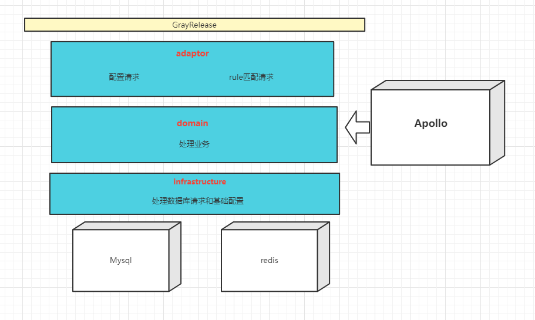

# GrayRelease

#### Description
版本升级项目，对客户端请求进行数据库的匹配并返回合适的升级包连接

#### Software Architecture

#### Contribution

#### Gitee Feature

1.  You can use Readme\_XXX.md to support different languages, such as Readme\_en.md, Readme\_zh.md
2.  Gitee blog [blog.gitee.com](https://blog.gitee.com)
3.  Explore open source project [https://gitee.com/explore](https://gitee.com/explore)
4.  The most valuable open source project [GVP](https://gitee.com/gvp)
5.  The manual of Gitee [https://gitee.com/help](https://gitee.com/help)
6.  The most popular members  [https://gitee.com/gitee-stars/](https://gitee.com/gitee-stars/)
