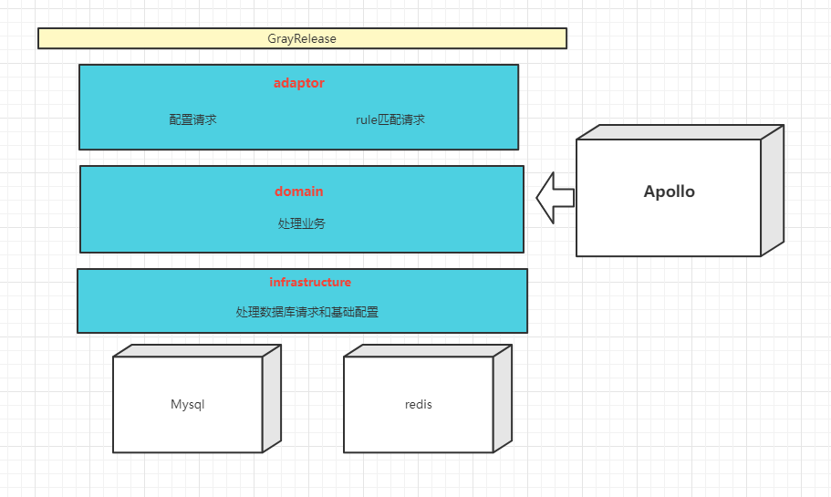

# GrayRelease

#### 介绍
版本升级项目，对客户端请求进行数据库的匹配并返回合适的升级包连接

#### 软件架构

#### 细节说明
    1） 对于rule的白名单过长给出的优化:
        - 使用redis的zset（（key是每个rule的对应的唯一的值,value是该rule的白名单））进行o(1)时间复杂度的匹配。
          每次从数据库获得rule 列表后,结合redis判断,
          如果此rule的key存在,继续判断其set中是否存在请求的设备id。如果有则返回true,没有则返回fasle。
          同时每次匹配完成都往redis中加入该rule的白名单
        - 当redis内存超出设定后,同时使用volatile-lfu的内存淘汰机制进行淘汰
    
    2）对于从数据库查询的优化：
        - 此项目使用mysql,在rule表上建立复合索引（列依次为:device_platform,channel,cpu_arch,aid）
          查询请求根据最左匹配充分利用索引
    
    3）对于版本号匹配的实现：
      （1） 8.4.2 > 8.1.3
      （2） 8.04.2 = 8.4.2
      （3） 8.4.2.1 > 8.4.2
      （4） 8.4.2 = 8.4.2.0
      （5） 8.4 > 8.1.3.4
        考虑到mysql不支持此匹配规则,则在应用层进行了一一匹配。

    4）应用层版本号,操作系统号匹配优化:
        不适用传统的for循环匹配,而使用fork-join 优化的stream 进行匹配,提高效率

    5）对于上限的规则进行暂停的实现:
        每一条rule都有一个属性 env（数据库中也有一个同样的列）,env 的取值仅限于(dev,pro)
        使用apollo配置中心配置需要进行下线的规则,应用层进行监听配置改变的时间。
        当apollo配置中心配置了某条规则后,即视为此规则下线(env 改为 dev)
        当apollo配置中心删除某条规则后,即视为此规则为上限(env 改为 pro)
    
        
### 贡献人员
    - 陈文杰
    - 鲁博
    - 张斌